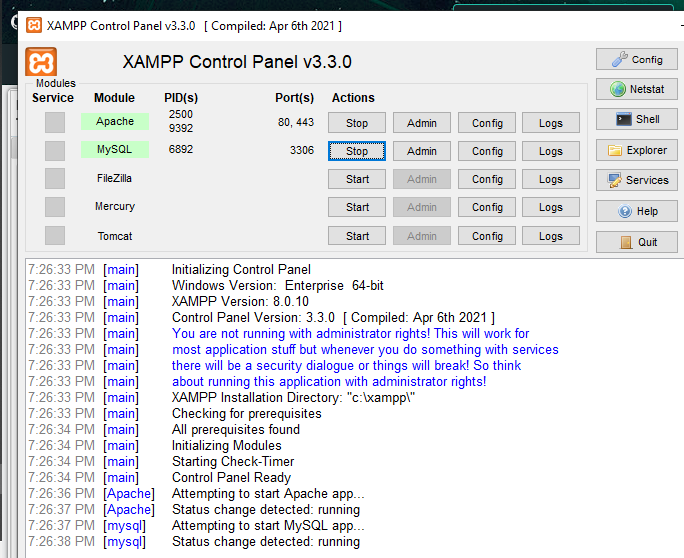
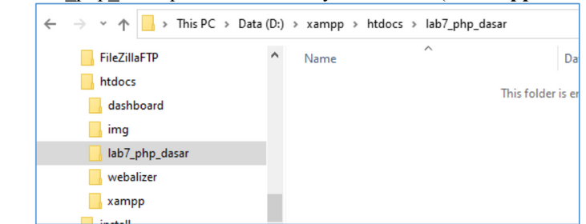
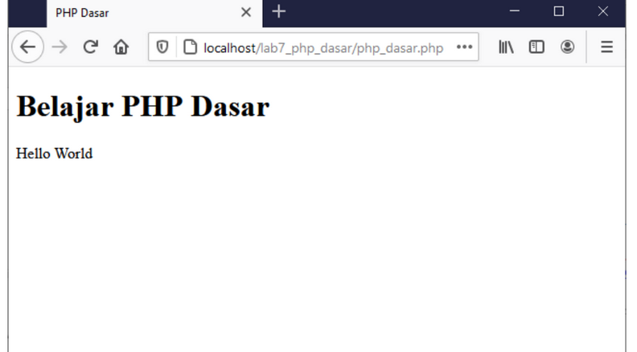
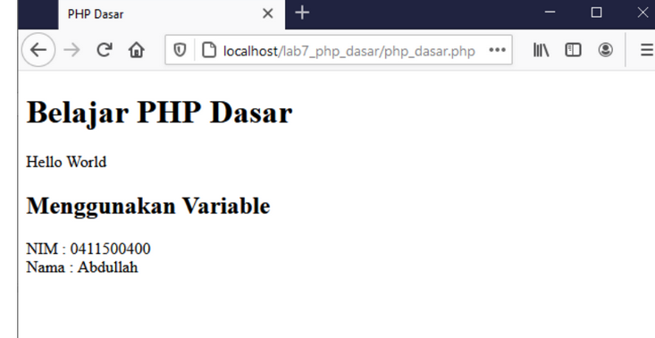
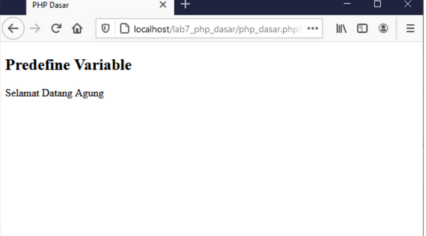
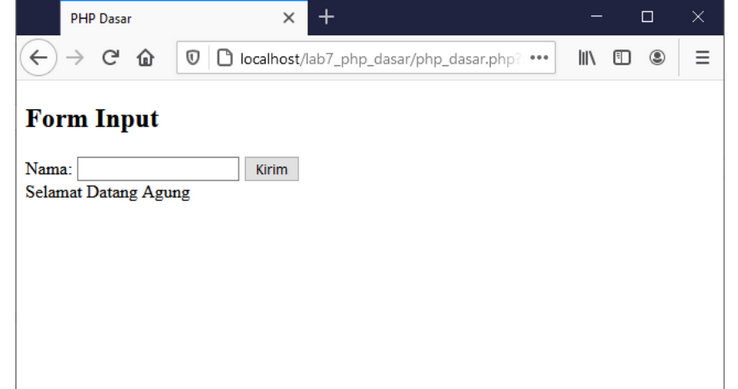
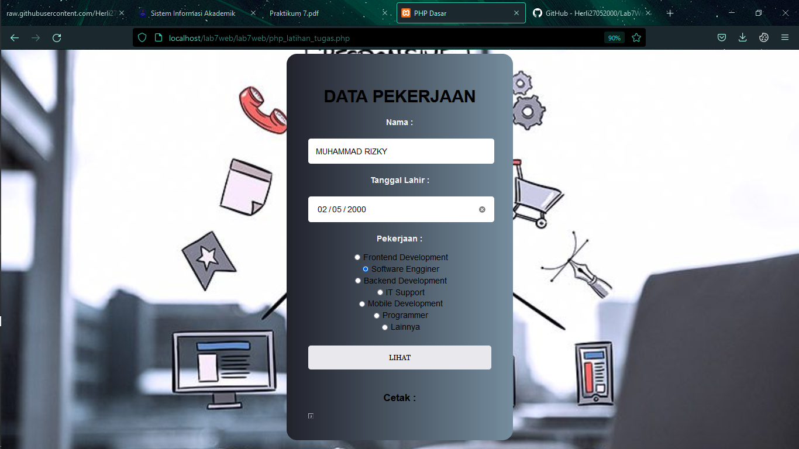
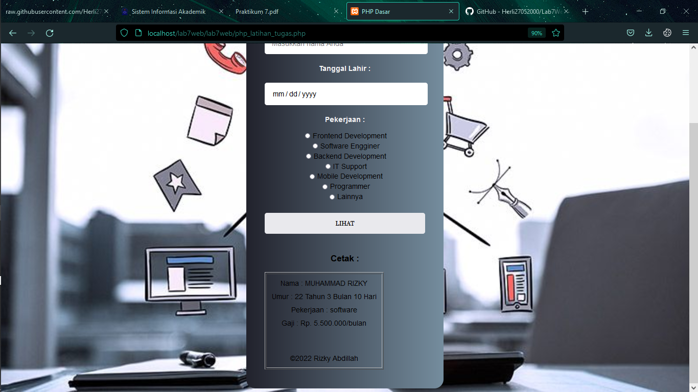

# Tugas Lab 7 Web
## Profil
| # | Biodata |
| -------- | --- |
| **Nama** | Muhammad Rizky Abdillah|
| **NIM** | 312010386 |
| **Kelas** | TI.20.A.2 |
| **Mata Kuliah** | Pemrograman Web |

## Tugas 
1. Buatlah program PHP sederhana dengan menggunakan form input yang menampilkan nama , tanggal lahir dan pekerjaan . Kemudian tampilkan outputnya dengan menghitung umur berdasarkan inputan tanggal lahir . Dan pilihan pekerjaan dengan gaji yang berbeda-beda sesuai pilihan pekerjaan.

## Laporan Praktikum
1. Buatlah repository baru dengan nama Lab7Web.
2. Kerjakan semua latihan yang diberikan sesuai urutannya.
3. Screenshot setiap perubahannya.
4. Buatlah file README.md dan tuliskan penjelasan dari setiap langkah praktikum
beserta screenshotnya.
5. Commit hasilnya pada repository masing-masing.
6. Kirim URL repository pada e-learning ecampus

## Langkah langkah praktikum
1. Install Terlebih dahulu untuk XAMPP SERVER di `https://www.apachefriends.org`
Install XAMPP untuk WEB SERVER dan kemudian ekstrak file nya dan sesuaikan dimana anda menyimpan file tersebut

2. Menjalankan XAMPP
Mengaktifkan XAMPP dengan menekan tombol START SERVER APACHE Seperti gambar di bawah ini


* tekan tombol start pada pilihan di apache

3. MEMULAI PRAKTIKUM
Buat folder lab7_php_dasar pada root directory web server(c:xampp\htdocs)


*Di atas saya membuat folder ***lab7_web_dasar*** yang dimana folder itu disimpan dalam folder **Lab7Web** untuk repository 

* Kemudian akses directory pada web server dengan mengakses URL:
http://localhost/Lab7_web_dasar/lab7web/

4. PHP Dasar
Buat File baru dengan nama **php_dasar.php** pada directory tersebut kemudian buat kode seperti berikut.

```
<!DOCTYPE html>
<html lang="en">
<head>
    <meta charset="UTF-8">
    <title>PHP Dasar</title>
</head>
<body>
    <h1>Belajar PHP Dasar</h1>
    <?php
        echo "Hello World";
    ?>
</body>
</html>
```
* Hasilnya


5. VARIABLE PHP
Menambahkan Variable pada program 



```
php
<h2>Menggunakan Variable</h2>
    <?php
       $nim = "001";
       $nama = 'KIKI';
       echo "NIM : " . $nim . "<br>";
       echo "Nama : $nama"; 
    ?>
```

6.  PREDEFINE VARIABLE $_GET
Menggunakan *Predefine Variable*
```
<?php>
echo 'Selamat Datang ' . $_GET['nama'];
<?>
```


7. MEMBUAT FORM INPUT 
```
<!DOCTYPE html>
<html lang="en">
<head>
<meta charset="UTF-8">
<title>PHP Dasar</title>
</head>
<body>
<h2>Form Input</h2>
<form method="post">
<label>Nama: </label>
<input type="text" name="nama">
<input type="submit" value="Kirim">
</form>
<?php
echo 'Selamat Datang ' . $_POST['nama'];
?>
</body>
</html>
```
*Dengan Hasil*


8. Operator Artimatika 

```
+ / // - *
```
```
<?php
$gaji = 1000000;
$pajak = 0.1;
$thp = $gaji - ($gaji*$pajak);
echo "Gaji sebelum pajak = Rp. $gaji <br>";
echo "Gaji yang dibawa pulang = Rp. $thp";
?>
```

9. KONDISI IF 

```
<?php
$nama_hari = date("l");
if ($nama_hari == "Sunday") {
echo "Minggu";
} elseif ($nama_hari == "Monday") {
echo "Senin";
} else {
echo "Selasa";
}
?>
```

10. KONDISI SWITCH

```
<?php
$nama_hari = date("l");
switch ($nama_hari) {
case "Sunday":
echo "Minggu";
break;
case "Monday":
echo "Senin";
break;
case "Tuesday":
echo "Selasa";
break;
default:
echo "Sabtu";
?>
```

11. PERULANGAN FOR 

```
<?php
echo "Perulangan 1 sampai 10 <br />";
for ($i=1; $i<=10; $i++) {
echo "Perulangan ke: " . $i . '<br />';
}
echo "Perulangan Menurun dari 10 ke 1 <br />";
for ($i=10; $i>=1; $i--) {
echo "Perulangan ke: " . $i . '<br />';
}
?>
```

12. PERULANGAN WHILE

```
<?php
echo "Perulangan 1 sampai 10 <br />";
$i=1;
while ($i<=10) {
echo "Perulangan ke: " . $i . '<br />';
$i++;
}
?>
```

13. PERULANGAN DOWHILE

```
<?php
echo "Perulangan 1 sampai 10 <br />";
$i=1;
do {
echo "Perulangan ke: " . $i . '<br />';
$i++;
} while ($i<=10);
?>
```

# TUGAS PRAKTIKUM PERTEMUAN 9

*SOURCE CODE* PROGRAM SEDERHANA MENGGUNAKAN FORM INPUT / OUTPUT

```
<!DOCTYPE html>
<html lang="en">
<head>
	 <meta charset="UTF-8">
 	 <title>PHP Dasar</title>
</head>
<style>
    table {
        text-align : center;
    }
    body {
    font-family:  'Lucida Sans Regular',  sans-serif;
    background-image :url("bg2.jpg");
    height: 100%;
    background-position: center;
    background-repeat: no-repeat;
    background-size: cover;
}

h1 {
  text-align: center;
}

form {
    text-align: center;
  padding: 25px;
}

.login {
    padding: 1em;
    margin: auto;
    width: 25em;
    background: linear-gradient(to right,#21222c, #758d9e);
    border-radius: 20px;
}
   
label {
    font-size: 10pt;
    color:whitesmoke;
}
   
input[type="text"],
input[type="date"] 
{
    padding: 15px;
    width: 93%;
    color: black;
    border: 10px;
    font-size: 1em;
    font-family: 'Arial';
    margin: 6px 0px;
    border-radius: 5px
}
   
input[type="submit"] {
    
    color: black;
    border: 0;
    margin: 5px 0px;
    padding: 15px;
    border-radius: 5px;
    width: 100%;
    font-family: 'Georgia';
}

input[type="submit"]:hover {
    background: #042631;
    cursor: pointer;
}

input[type="radio"] {
    margin: 5px;
    align-items: center;
    cursor: pointer;
}

p {
  margin: 10px;
}
</style>
<body>
	<div class="login">
    <form method="post">
    <h1>DATA PEKERJAAN</h1>
        <label> <h3>Nama : </h3></label>
        <input type="text" name="nama" placeholder="Masukkan nama Anda">
        <br>
        <label> <h3>Tanggal Lahir : </h3></label>
        <input type="date" name="tanggal">
        <br>
        <label><h3>Pekerjaan : </h3></label>
        <input type="radio" name="pekerjaan" value="frontend">Frontend Development</input><br>
        <input type="radio" name="pekerjaan" value="software">Software Engginer</input><br>
        <input type="radio" name="pekerjaan" value="backend">Backend Development</input><br>
        <input type="radio" name="pekerjaan" value="support">IT Support</input><br>
        <input type="radio" name="pekerjaan" value="mobile">Mobile Development</input><br>
        <input type="radio" name="pekerjaan" value="programmer">Programmer</input><br>
        <input type="radio" name="pekerjaan" value="lainnya">Lainnya</input><br>
        <br>
        <input type="submit" name="button" value="LIHAT">
        <br>
        <br>
        <h3>Cetak : </h3>
<table border=1 text-align="center">
    <tr>
        <td>
        <?php
    $lahir = @$_GET['tanggal'];
    $button = @$_POST['button'];

    if ($button) {
        $nama=$_POST['nama'];
        $job=@$_POST['pekerjaan'];
        echo "<p>Nama : $nama</p>";
        $tanggal_lahir = new DateTime($_POST['tanggal']);
        $sekarang = new DateTime("today");
        if ($tanggal_lahir > $sekarang) { 
            $thn = "0";
            $bln = "0";
            $tgl = "0";
        }
        $thn = $sekarang->diff($tanggal_lahir)->y;
        $bln = $sekarang->diff($tanggal_lahir)->m;
        $tgl = $sekarang->diff($tanggal_lahir)->d;
        echo "<p>Umur : ";
        echo $thn." Tahun ".$bln." Bulan ".$tgl." Hari";
         
        if ($job=="frontend") {
            echo "<p>Pekerjaan : $job</p> ";
            echo "<p>Gaji : Rp. 15.100.000/bulan</p>";
        }
        elseif ($job=="software") {
            echo "<p>Pekerjaan : $job</p> ";
            echo "<p>Gaji : Rp. 25.500.000/bulan</p>";
        }
        elseif ($job=="backend") {
            echo "<p>Pekerjaan : $job</p> ";
            echo "<p>Gaji : Rp. 34.415.000/bulan</p>";
        }
        elseif ($job=="support") {
            echo "<p>Pekerjaan : $job</p> ";
            echo "<p>Gaji : Rp. 16.000.000/bulan</p>";
        }
        elseif ($job=="mobile") {
            echo "<p>Pekerjaan : $job</p> ";
            echo "<p>Gaji : Rp. 30.500.000/bulan</p>";
        }
        elseif ($job=="programmer") {
            echo "<p>Pekerjaan : $job</p> ";
            echo "<p>Gaji : Rp. 20.000.000/bulan</p>";
        }
        elseif ($job=="lainnya") {
            echo "<p>Pekerjaan : $job</p> ";
            echo "<p>Gaji : Rp.(Sesuai pekerjaan)/bulan</p>";
        }
        else {
            echo "<p>Pilih Pekerjaan</p>";
        }
        echo "<br><br><p>&copy;" . date("Y") . " Rizky Abdillah</p>";
    }
    ?>
        </td>
    </tr>
</table>
</form>
</body>
</html> 
```


*OUTPUT*


